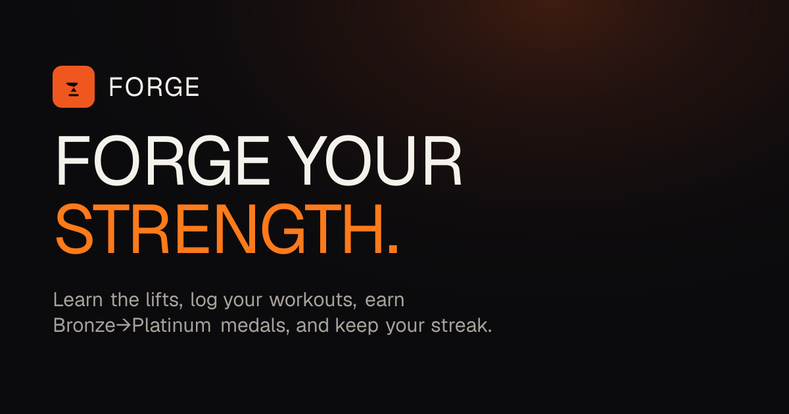

<div align="center">



# Forge 🔥

**Forge your strength.** — a gamified strength-training companion for gym beginners.

[](https://github.com/kkostia/forge/actions/workflows/ci.yml)

</div>

Forge turns the intimidating first months in the gym into a game. Beginners learn the core
lifts, log their workouts, and watch raw iron turn into **Bronze → Platinum medals** as they get
stronger — while a 🔥 streak keeps them honest and an AI coach answers the questions they're too
shy to ask a trainer.

> 🔗 **Live demo:** _add your Vercel URL here after deploy_ · Demo login: `demo@forge.app` / `forgedemo123`

---

## Highlights

- **Learn the lifts** — a library of 31 fundamental exercises with step-by-step instructions,
  per-exercise lifehacks, equipment, and **animated SVG movement guides** (six motion archetypes,
  pure CSS, reduced-motion aware).
- **Log workouts** — pick a day on a themed calendar, add exercises with a searchable combobox,
  record weight / reps / rest, edit and delete sets, jot session notes.
- **Earn medals** — each muscle group is anchored by one core lift (Bench, Squat, Deadlift,
  Overhead Press, Curl, Weighted Plank). Cross a weight threshold on your **best working set** and
  Forge mints the medal with a shining animation and a toast.
- **Keep a streak** — set the weekdays you plan to train; the streak counts consecutive planned
  days you didn't skip, with a GitHub-style heatmap and a flame that brightens as it grows.
- **Ask the AI coach** — *"why does my shoulder hurt when I bench?"*, *"why has my bench
  stalled?"* — answered by OpenAI, grounded in the exercise knowledge base **and the user's own
  recent logs, medals, and streak**. Degrades to a scripted, data-aware reply with no API key.

## Tech stack

| Layer | Choice |
|---|---|
| Language | **TypeScript** |
| Framework | **Next.js 16** (App Router — UI, Route Handlers, Server Actions) |
| Database + Auth | **Supabase** (Postgres, Supabase Auth, Row Level Security) |
| AI | **Vercel AI SDK v6** + **OpenAI** (`gpt-4o-mini`) |
| Styling | **Tailwind CSS v4** + custom components on **Radix** primitives |
| Motion | **Framer Motion** + CSS |
| Charts / Calendar | **Recharts** · **react-day-picker** |
| Validation | **Zod** |
| Tests | **Vitest** (pure medal/streak/progress logic) |
| Hosting | **Vercel** + **Supabase** · package manager **pnpm** |

> The UI is deliberately custom — an "industrial forge meets modern athletic" design language
> (deep charcoal, ember accent, metallic medal badges, condensed Anton display type, film-grain
> texture). No template clichés, no tech badges in the product itself.

## Architecture notes

- **Auth & routing.** Supabase Auth (email/password) with `@supabase/ssr`. A Next 16 `proxy`
  (formerly middleware) refreshes the session cookie and guards `/app/*` and `/onboarding`;
  pages additionally gate on an onboarding flag. RLS ensures every query only ever returns the
  signed-in user's rows; the exercise library is public-read.
- **Pure core logic.** Medals (`src/lib/medals.ts`, `medal-state.ts`), streak (`src/lib/streak.ts`),
  and progress aggregation (`src/lib/progress.ts`) are pure functions with no I/O — easy to reason
  about and **unit-tested** (35 Vitest cases incl. the 20/50/75/100 medal boundaries and streak
  edge cases). The server layer just feeds them rows.
- **Medals on save.** Logging a set recomputes group medals from the user's best *working* sets
  (reps ≥ 3) and persists newly earned `Achievement` rows idempotently, returning the freshly
  minted tiers so the client can celebrate.
- **Grounded AI.** `/api/coach` injects a compact `ATHLETE DATA` + `KNOWLEDGE BASE` block
  (medals, PRs, streak, recent sessions, relevant lifehacks) into the system prompt, streams the
  reply, and persists both sides of the conversation.
- **Graceful degradation.** The app builds and runs with no keys: the exercise library falls back
  to the bundled seed catalog and the coach returns a scripted reply — so a fresh clone and the
  CI build both work without secrets.

## Data model

`profiles` · `exercises` · `workout_sessions` · `set_entries` · `achievements` · `chat_messages`
— see [`supabase/migrations/0001_init.sql`](supabase/migrations/0001_init.sql) for the full schema,
enums, indexes, the `handle_new_user` trigger, and RLS policies.

## Local setup

```bash
pnpm install
cp .env.example .env.local       # fill in the keys below
pnpm dev                         # http://localhost:3000
```

Apply the schema and seed the exercises (see [`supabase/README.md`](supabase/README.md)):

```bash
# 1. Run supabase/migrations/0001_init.sql in the Supabase SQL editor (or `supabase db push`)
# 2. Seed the 31-exercise knowledge base:
pnpm seed
```

### Environment variables

| Variable | Required | Purpose |
|---|---|---|
| `NEXT_PUBLIC_SUPABASE_URL` | yes | Supabase project URL |
| `NEXT_PUBLIC_SUPABASE_ANON_KEY` | yes | Supabase anon (public) key |
| `SUPABASE_SERVICE_ROLE_KEY` | server only | Seeding / admin (never commit) |
| `OPENAI_API_KEY` | optional | AI coach; falls back to a scripted reply if unset |
| `NEXT_PUBLIC_APP_URL` | optional | Canonical app URL (metadata) |

### Scripts

```bash
pnpm dev          # dev server
pnpm build        # production build
pnpm test         # vitest unit tests
pnpm lint         # eslint
pnpm typecheck    # tsc --noEmit
pnpm seed         # upsert the exercise catalog into Supabase
```

## Deploy

1. Create a **Supabase** project; apply the migration and run `pnpm seed` against it.
2. Import the repo into **Vercel**; add the env vars above.
3. Deploy. The included GitHub Actions workflow runs lint + typecheck + tests + build on every push.

---

<div align="center">
<sub>A portfolio project. Train responsibly — this is not medical advice.</sub>
</div>
